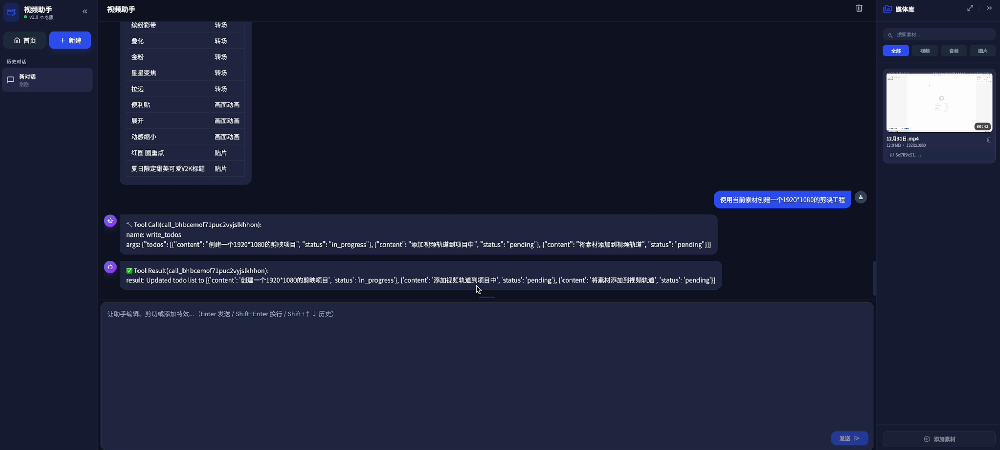

# 🎬 CapCut Agent - AI 视频剪辑助手

基于 LangGraph + Flask 的智能视频剪辑助手，通过对话式交互帮助用户使用剪映（CapCut）完成视频剪辑任务。

[](https://github.com/qingpingwang/capcut-agent)
[](https://www.python.org/)
[](LICENSE)
[](https://github.com/langchain-ai/langgraph)

## ✨ 功能特性

- 🤖 **AI 对话交互** - 自然语言理解视频剪辑需求
- 🎥 **素材管理** - 上传、预览、删除视频/音频/图片素材
- ⚡ **流式输出** - 基于 SSE 的实时消息流式传输
- 📝 **Markdown 渲染** - 支持富文本格式的消息展示
- 💾 **持久化存储** - SQLite + LangGraph Checkpointer 保存对话历史
- 🎨 **现代化 UI** - 暗色主题，响应式设计
- 🔧 **剪映工具集成** - 通过 MCP 调用剪映 API 完成视频制作

## 📸 界面预览

<div align="center">
  
  <p><i>AI 对话界面 - 通过自然语言完成视频剪辑</i></p>
</div>

**核心功能展示：**
- 🎨 **左侧边栏** - 历史对话管理，快速切换项目
- 💬 **中间聊天区** - AI 流式对话交互，实时响应
- 📁 **右侧素材库** - 媒体资源管理，支持筛选和搜索
- ⚡ **流畅体验** - 暗色主题，现代化界面设计

## 🛠️ 技术栈

### 后端

- **Python 3.12+**
- **Flask** - Web 框架
- **LangGraph** - Agent 工作流编排
- **LangChain** - LLM 抽象层
- **SQLite** - 数据持久化
- **FastMCP** - MCP 工具服务器

### 前端

- **Vanilla JavaScript (ES6+)** - 模块化组件
- **Tailwind CSS** - 样式框架
- **Marked.js** - Markdown 渲染
- **SSE (Server-Sent Events)** - 流式通信

## 📦 快速开始

### 1. 克隆项目

```bash
git clone --recurse-submodules https://github.com/qingpingwang/capcut-agent.git
cd capcut-agent
```

如果已克隆但未初始化 submodule：

```bash
./init.sh
```

### 2. 安装依赖

```bash
pip install -r requirements.txt
```

### 3. 配置环境变量

复制 `.env.example` 为 `.env` 并填写配置：

```bash
cp .env.example .env
```

编辑 `.env` 文件，填入你的 OpenAI API Key：

```env
OPENAI_API_KEY=your-api-key-here
```

> 其他配置项已有默认值，可根据需要调整。

### 4. 启动服务

```bash
# 使用启动脚本（推荐）
./start.sh

# 或直接运行
python server.py
```

🎉 服务将运行在 `http://localhost:5000`，在浏览器中打开即可使用！

### 5. 停止服务

```bash
./stop.sh
```

## 🎯 使用指南

### 创建新对话

1. 访问 `http://localhost:5000`
2. 点击「新建项目」按钮
3. 在聊天框中输入你的剪辑需求

### 上传素材

1. 点击右侧「素材库」
2. 点击「上传素材」按钮
3. 选择视频、音频或图片文件
4. 等待上传完成

### 管理素材

- **筛选**：点击「全部」「视频」「音频」「图片」筛选不同类型
- **搜索**：在搜索框输入关键词（支持名称、分辨率、时长等）
- **预览**：点击素材卡片查看详情
- **复制 ID**：点击素材 ID 复制到剪贴板
- **删除**：点击垃圾桶图标删除素材

### 对话示例

```
用户：帮我制作一个 15 秒的短视频

AI：好的！我需要一些信息：
1. 视频内容主题是什么？
2. 需要使用哪些素材？
3. 是否需要添加背景音乐和字幕？

用户：使用素材 `abc123` 和 `def456`，添加欢快的背景音乐

AI：明白了！我将使用以下配置：
- 素材：`abc123`（视频）、`def456`（音频）
- 时长：15 秒
- 背景音乐：欢快风格

现在开始制作...
```

## 📁 项目结构

```
capcut-agent/
├── server.py                    # Flask 服务器入口
├── requirements.txt             # Python 依赖
├── .env.example                 # 环境变量示例
├── README.md                    # 项目文档
├── init.sh                      # 初始化 submodules 脚本
├── start.sh                     # 启动服务脚本
├── stop.sh                      # 停止服务脚本
│
├── src/                         # 后端源码
│   ├── __init__.py
│   ├── agents/                  # Agent 相关
│   │   ├── models.py           # 状态模型、LLM 配置
│   │   └── workflow.py         # LangGraph 工作流
│   └── utils/                   # 工具函数
│       ├── jianying_tools.py   # 剪映工具集（MCP）
│       └── mcp_loader.py       # MCP 工具加载器
│
├── rag/                         # RAG 模块（剪映资源检索）
│   ├── __init__.py
│   ├── feishu_doc_utils.py     # 飞书文档工具
│   ├── get_res_from_feishu.py  # 从飞书获取资源
│   └── data/                    # 剪映资源数据
│       ├── 文字动画.json
│       ├── 画面动画.json
│       ├── 特效.json
│       ├── 滤镜.json
│       ├── 转场.json
│       ├── 贴片.json
│       └── 音效.json
│
├── static/                      # 前端静态资源
│   ├── index.html              # 主页面
│   └── js/                     # JavaScript 模块
│       ├── app.js              # 应用主类
│       ├── utils.js            # 工具函数
│       └── components/         # 组件
│           ├── chat.js         # 聊天组件
│           ├── sidebar.js      # 侧边栏组件
│           ├── media-library.js # 素材库组件
│           ├── home.js         # 首页组件
│           └── toast.js        # 通知组件
│
├── external/                    # 外部依赖（Git Submodules）
│   └── jianying-protocol-service/  # 剪映协议服务
│
└── data/                        # 数据存储目录（自动生成）
    ├── checkpoints.db          # LangGraph checkpoint 数据库
    ├── log.log                 # 应用日志
    └── uploads/                # 上传的素材文件
        └── <thread_id>/        # 按对话 ID 分组
```

## 🎬 剪映功能支持

项目通过 **MCP (Model Context Protocol)** 深度集成剪映 API，提供完整的视频制作能力：

### 📦 素材资源库
- **特效** - 视觉特效（粒子、光效、动态元素等）
- **滤镜** - 色彩滤镜（复古、电影、清新等风格）
- **转场** - 场景转换（淡入淡出、切换、特效转场）
- **贴片** - 装饰贴纸素材
- **音效** - 音效素材（背景音、提示音等）

> 📝 **可扩展**：资源数据存储在 `rag/data/` 目录，可自行添加更多素材

### 🎨 动画效果
- **文字动画** - 文字入场/出场动画
- **画面动画** - 镜头运动效果

### ⚙️ 核心能力
- ✅ 智能素材管理（上传、检索、删除）
- ✅ 自动化视频编辑（剪切、拼接、调速）
- ✅ AI 特效推荐（基于场景自动匹配）
- ✅ 实时预览与导出
- ✅ 离线资源检索与推荐

## 🚀 开发指南

### 添加新工具

在 `src/utils/jianying_tools.py` 中添加新的 MCP 工具：

```python
@mcp.tool()
def my_new_tool(param1: str, param2: int) -> dict:
    """工具描述
  
    Args:
        param1: 参数1说明
        param2: 参数2说明
  
    Returns:
        返回值说明
    """
    # 实现逻辑
    return {"result": "success"}
```

## 🐛 常见问题

### Q: 启动时提示 `OPENAI_API_KEY not found`

**A:** 确保创建了 `.env` 文件并正确填写了 `OPENAI_API_KEY`。

### Q: 上传素材失败

**A:** 检查：

1. 文件格式是否支持（视频：mp4/mov/avi，音频：mp3/wav，图片：jpg/png）
2. 文件大小是否过大
3. `data/uploads/` 目录是否有写权限

### Q: 对话历史丢失

**A:** 检查：

1. `data/checkpoints.db` 文件是否存在
2. SQLite 数据库权限是否正确
3. 是否误删了数据库文件

### Q: Submodule 未初始化

**A:** 运行初始化脚本：

```bash
./init.sh
```

或手动初始化：

```bash
git submodule update --init --recursive
```

## 📝 API 文档

### 流式对话

```http
POST /api/chat/stream
Content-Type: application/json

{
  "thread_id": "uuid",
  "message": "用户消息"
}
```

返回 SSE 流：

```
data: {"type": "thread_id", "thread_id": "..."}
data: {"type": "message_change", "role": "ai"}
data: {"type": "token", "content": "...", "chunk_position": null}
data: {"type": "token", "content": "...", "chunk_position": "last"}
data: {"type": "done"}
```

## 📧 联系方式

如有问题或建议，欢迎通过以下方式联系：

- 提交 [GitHub Issue](https://github.com/qingpingwang/capcut-agent/issues)
- 发起 [Pull Request](https://github.com/qingpingwang/capcut-agent/pulls)

---

**Made with ❤️ by [qingpingwang](https://github.com/qingpingwang)**
